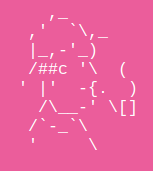

# Holmes

[](https://travis-ci.org/justsocialapps/holmes)

A simple analytics server written in Go, including a JavaScript client library.

Holmes collects tracking information via the provided client library or by
direct calls to the tracking URL, enriches that information with details about
the refering user (such as HTTP Referer, IP Address) and passes this information
on to a Kafka server (on the `tracking` topic).



# Installation

To install Holmes, run 

```sh
go get github.com/justsocialapps/holmes
```

or grab the binary of the [most current
release](https://github.com/justsocialapps/holmes/releases).

# Running

To start Holmes, simply call `holmes` (assuming that $GOPATH/bin is on your
$PATH), passing the parameters fit to your environment (see below).

# Configuration

The startup configuration of Holmes is provided via command-line parameters.
Type `holmes -h` to get a list of all parameters.

# Usage

Holmes provides a JavaScript client library that exposes a function to track
certain user actions. Include that library into your pages and call the tracking
function whenever appropriate. Here's the script tag for including the lib:

```html
<script>
    !function(){var e="HOLMES_BASE_URL/analytics.js",t=document,a=t.createElement("script"),r=t.getElementsByTagName("script")[0];a.type="text/javascript",a.async=!0,a.defer=!0,a.src=e,r.parentNode.insertBefore(a,r)}();
</script>
```

Replace `HOLMES_BASE_URL` with the address where users can reach Holmes. Then
you can start tracking:

```javascript
if (typeof (window.Holmes) === 'undefined') {
    return;
}
window.Holmes.track(TRACKING_OBJECT);
```

The check for `window.Holmes` is necessary since the JavaScript will load
asynchronously. `TRACKING_OBJECT` may be any JSON-serializable JavaScript
object. When calling `track`, Holmes will send a JSON object to the Kafka server
that looks like this:

```
{
    "referer": HTTP_REFERER,
    "ipAddress": REMOTE_IP_ADDRESS,
    "time": CURRENT_SERVER_UNIX_TIMESTAMP_IN_MS,
    "target": TRACKING_OBJECT
}
```

## The `holmesloaded` event

When Holmes is fully loaded it fires a `holmesloaded` event on the `window`
object. This is useful if you want to configure or track things after your page
loaded. Make sure to register the event listener before Holmes is loaded. You
might miss the event otherwise:

```html
<script>
    window.addEventListener('holmesloaded', function() {
        // Configure holmes here
    });

    !function(){var e="HOLMES_BASE_URL/analytics.js",t=document,a=t.createElement("script"),r=t.getElementsByTagName("script")[0];a.type="text/javascript",a.async=!0,a.defer=!0,a.src=e,r.parentNode.insertBefore(a,r)}();
</script>
```

## Enrich tracking events

You can add application-specific fields to tracking events by calling
`Holmes.addTrackingEnricher(enricherFunc)`. The client library then calls those
functions whenever you call `Holmes.track()` and passes the tracking event
object as argument. The `enricherFunc` can add additional data to this event.

Note that you should configure Holmes after the `holmesloaded` event was fired.

In the following example two fields are added to every tracking event.
`applicationVersion` will be set to `1.2.3` and `applicationDate` to the current
date:

```javascript
window.addEventListener('holmesloaded', function() {
    window.Holmes.addTrackingEnricher(function(e) {
        e.applicationVersion = '1.2.3';
    });
    window.Holmes.addTrackingEnricher(function(e) {
        e.applicationDate = new Date().toString();
    });
});
```

# Development

Hacking on Holmes normally involves no specific setup. Just retrieve the code
and you're ready to get going. Although, there's one case where you need further
setup:

## Generating assets

The contents of the `analytics.js` file are included in the Holmes binary so
that you don't need to deploy them separately from it. Also, the Holmes banner
that is printed on stdout upon startup is part of the binary. This means that
any changes to the assets found in the `assets/` directory must be followed by a
`go generate` call. Since the `analytics.js` file is then minified, the
executable `uglifyjs` must be present on your `$PATH`. The simplest way to get
it is to issue `npm install -g uglify-js`.

Then, you can just call `go generate` and you'll have access to the contents of
the files found in `assets/` in Holmes' source code. The variable name will be
the name of the file with `.` removed. This is, when you put the file
`hello.txt` in the `assets/` directory, then `go generate` will include a
variable named `Hellotxt` in the generated assets file, containing the contents
of the `hello.txt` file.

## Publishing a release

When you're done hacking you presumably want to publish a new release. The
script [publish-release.sh](scripts/publish-release.sh) helps you with that. It
makes use of [gothub](https://github.com/itchio/gothub) which you'll have to 
install first:

```sh
go get github.com/itchio/gothub
./scripts/publish-release.sh VERSION "A short description" YOUR_GITHUB_KEY
```

Replace `VERSION` with the version number of your release (e.g. 1.8.0) and
`YOUR_GITHUB_KEY` with the key that you generated using the instructions from
https://help.github.com/articles/creating-a-personal-access-token-for-the-command-line/.

# License

This software is distributed under the BSD 2-Clause License, see
[LICENSE](LICENSE) for more information.
